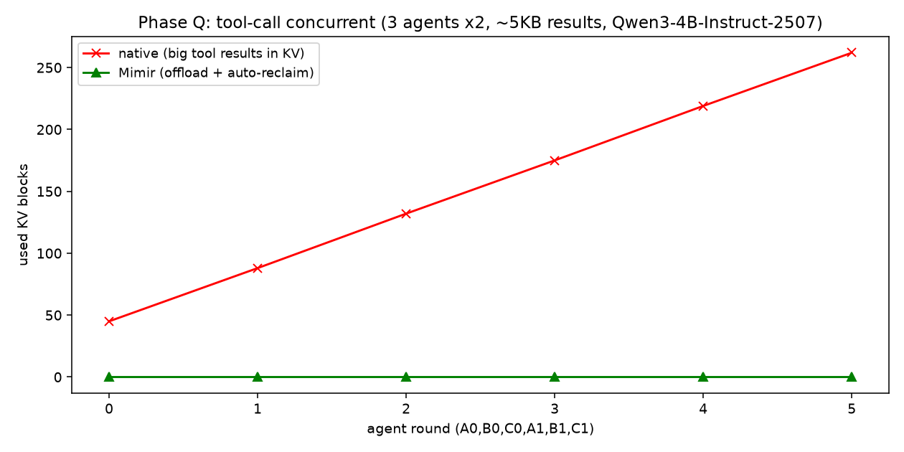

# Mimir — 面向智能体的内存管理系统

> Mimir 取名自北欧神话中以智慧与记忆闻名者，寓意本项目聚焦于智能体推理过程中**记忆（KV Cache / 上下文）的管理与复用**。
>
> 📊 **结果总览（评审速读）**：[docs/RESULTS_SUMMARY.md](docs/RESULTS_SUMMARY.md) — 四个决定性引擎级 A/B（used_blocks 69 / 14 / 27 / **262** → 0）、tool_call TTFT **-91%**、分支 CoW **-78.7%**、多模型泛化。
>
> 🔥 **最强一击（Phase Q，工具调用并发）**：3 个 agent × 2 轮工具调用（每轮含 ~5KB 工具返回），原生 vLLM KV 累积到 **262 块**，Mimir（工具外置 + 逐任务自动回收）保持 **0 块**（reclaims=42）。\
> 

<p align="center">
  <b>研究创新赛道 · 面向智能体的内存管理系统设计与实现（高校赛题）</b>
</p>

## 项目简介

随着基于大语言模型（LLM）的智能体系统发展，推理范式已由传统的单轮生成扩展为涵盖
**规划 → 执行 → 反思**的长生命周期复杂过程。在这一过程中，智能体需进行多轮动态交互并频繁调用
工具与外部环境，导致推理上下文持续增长与反复重构，并带来 **KV Cache 持续累积、上下文高度冗余、
推理路径分支、工具调用产生大规模中间数据**等典型问题。

**Mimir** 是一个面向智能体推理过程的内存管理系统，在保证推理效果的前提下，通过对
KV Cache、上下文结构及显存分配机制的系统性优化，有效降低内存占用并提升整体推理效率。

## vLLM 0.10.2 In-Tree Patch（内核级优化）

Mimir 不仅在 vLLM 之上做外部封装，更**直接 patch 了 vLLM v0.10.2 源码**（拍平为普通目录
`third_party/vllm_flat`（源自 v0.10.2 fork `mimir-patches-v0.10.2`），纯 Python、不重编 `_C`）：

| 引擎层 patch | 真实验证 |
| --- | --- |
| **任务边界主动回收**（`block_pool.mimir_finish_task`） | 2 agent 任务的 10 个 KV 块 used_blocks **10→0**（vLLM LRU 做不到） |
| **分支 CoW 复用记账**（`kv_cache_manager`） | 4 分支测得 **9 次跨分支 KV 复用**（与 BranchTree 预测一致） |
| **per-block KV-pin**（lifecycle-bounded） | agent 3 块 in agent B 压力下 **3/3 存活** |
| **fp8 KV 优雅降级**（arg_utils oracle） | 不支持的硬件上**降级 bf16**而非崩溃 |
| **'mimir' 调度策略**（`SchedulerPolicy` + `MimirRequestQueue`） | `scheduling_policy="mimir"` 跑通 |

详见 [`docs/VLLM_PATCH_INVENTORY.md`](docs/VLLM_PATCH_INVENTORY.md) 与 [`docs/VLLM_EDITABLE_SETUP.md`](docs/VLLM_EDITABLE_SETUP.md)。
区别于同实验室 Continuum（pin 工具调用暂停）—— Mimir 在任务边界主动回收 + per-block pin + CoW 记账 + fp8 容错。

## 核心优化方向

本赛题推荐的优化方向，本项目均规划支持（详见 [`docs/技术方案.md`](docs/技术方案.md)）：

| 模块 | 方向 | 说明 |
| --- | --- | --- |
| `mimir.kv_cache` | KV Cache 生命周期管理 | KV 的复用、淘汰与分层存储，支持动态资源回收与重分配 |
| `mimir.branch` | 分支推理内存共享 | 多路径决策下的 KV Cache 共享与 Copy-on-Write 机制 |
| `mimir.context` | Prompt 与上下文压缩 | 对 system prompt / 工具描述去重与精简，消除冗余 |
| `mimir.tools` | 工具调用数据优化 | 中间数据结构化存储或按需加载，避免完全进入 KV Cache |
| `mimir.tiered` | 分层内存与异构存储 | GPU 显存 / 主存 / 外部存储间的冷热分离与动态迁移 |
| `mimir.hardware` | 异构 AI 加速硬件支持 | 适配 CUDA / DTK / CANN 等异构平台与国产化算力 |

## 技术栈

- **基础推理框架**：vLLM / llama.cpp（在其之上扩展）
- **开源模型**：Qwen、MiniCPM 等
- **运行系统**：openEuler / openKylin / OpenHarmony 等（鼓励在更多 Linux 发行版上编译运行）
- **开发语言**：Python（核心），关键性能路径可选 C++ 扩展

## 目录结构

```
Mimir/
├── README.md              # 项目说明
├── CLAUDE.md              # Claude Code 协作约定
├── LICENSE                # Apache-2.0
├── pyproject.toml         # Python 项目配置
├── requirements.txt       # 依赖清单
├── Makefile               # 常用开发命令
├── docs/                  # 文档（赛题、技术方案、设计、部署、测试报告）
├── src/mimir/             # 源代码主包
├── tests/                 # 单元测试
└── benchmarks/            # Benchmark 测试方案
```

## 快速开始

> **重要**：vLLM v0.10.2 已**拍平为普通目录** `third_party/vllm_flat`（不再是 submodule），
> 通过 `.pth` + dist-info 接入（详见 [`docs/VLLM_EDITABLE_SETUP.md`](docs/VLLM_EDITABLE_SETUP.md)）。
> 因此新 clone / 新环境**必须先 `source scripts/activate_env.sh`** 才能 `import vllm`。
> 该脚本幂等地：`conda activate mimir` → 写 `.pth`/dist-info → `LD_LIBRARY_PATH += torch/lib` → v1 单进程 env。

```bash
# 0. 首次：重建 vLLM 预编译二进制（fresh clone 需此步，~1 分钟）
bash scripts/setup_vllm_binaries.sh   # 从 vllm==0.10.2 wheel 提取 .so + flash_attn，symlink 进 vllm_flat
#    （vllm_prebuilt_bin/ 被 gitignore，不入库；详见 docs/VLLM_EDITABLE_SETUP.md）

# 1. conda 环境 mimir（python 3.11 + torch 2.8.0+cu128 + vllm 0.10.2 依赖）
source /opt/miniconda3/etc/profile.d/conda.sh
conda activate mimir
pip install -e ".[dev]"          # Mimir 自身

# 2. 激活 vLLM flat 接入（每次会话）
source scripts/activate_env.sh

# 3. 一键复现验证（CPU 模式 ~2 分钟）
make reproduce    # 或 bash scripts/reproduce.sh --quick

# 4. 全量 Benchmark（需空闲单卡）
make benchmark    # 或单跑：python scripts/run_phase_m_ab.py
```

## 复现性说明

- 优化前后使用**相同的硬件配置**进行评估
- 基于**开源大模型**（Qwen / MiniCPM 等）构建可复现的 Benchmark 测试方案
- 所有评测脚本位于 [`benchmarks/`](benchmarks)，结果与报告位于 [`docs/测试报告.md`](docs/测试报告.md)

## 赛题信息

完整赛题说明见 [`docs/赛题说明.md`](docs/赛题说明.md)。

- 赛道：研究创新赛道
- 赛题：面向智能体的内存管理系统设计与实现（高校赛题）
- 赛题联系人：张老师 jfzhang@nudt.edu.cn

## License

[Apache License 2.0](LICENSE)
